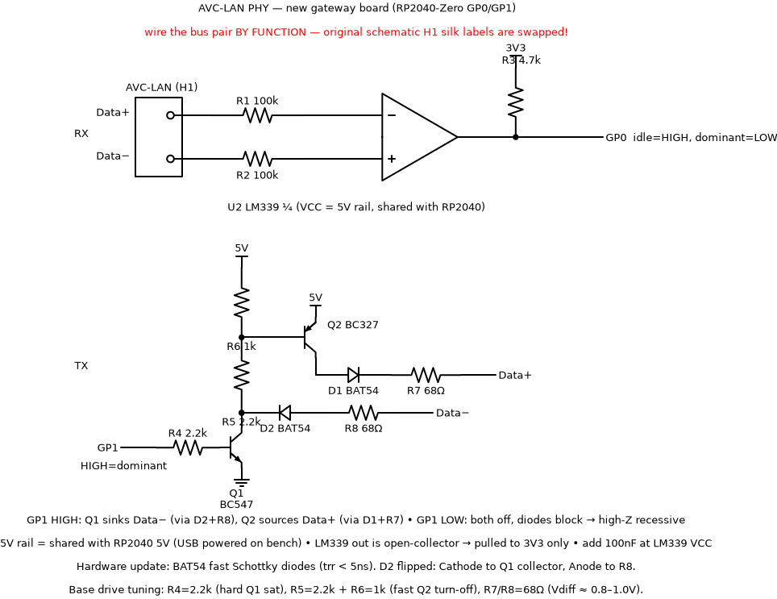

# AVC-LAN Physical Interface (PHY) — Reference for Rebuild

Reverse-documented 2026-09-08 from `docs/schematic.json` (EasyEDA netlist —
authoritative) cross-checked against `docs/schematic.png` and the PIO
configuration in `main.py`. This is the circuit between the Prius AVC-LAN
twisted pair and the RP2040-Zero (GP0 RX / GP1 TX).

AVC-LAN is Toyota's IEBus variant: a differential two-wire bus, pulse-width
encoded, dominant state = Data+ pulled above Data−. The PHY has two
independent halves sharing the bus connector H1.

## Connector — ⚠ LABEL BUG IN THE ORIGINAL SCHEMATIC

The original EasyEDA schematic prints "Data −" on H1's TOP pin and
"Data +" on the BOTTOM pin, but the netlist proves those text labels are
**swapped relative to electrical function**:

- the TOP pin is the one Q2 *sources toward 5 V* during dominant and the
  one feeding the comparator's INVERTING input — that is the bus **Data+**
  (IEBus dominant = Data+ pulled above Data−);
- the BOTTOM pin is sunk to GND during dominant and feeds IN+ — that is
  **Data−**.

Both RX polarity (firmware needs GP0 idle-HIGH / dominant-LOW, which
requires Data+ → IN−) and TX drive direction confirm this. The built
board works, so the car harness is attached per FUNCTION, not per the
printed labels.

**For the rebuild, wire by function and verify, don't trust the old
silk/labels:**

| H1 pin (top/bottom in schematic) | Electrical function | Connects to |
|----------------------------------|---------------------|-------------|
| TOP ("Data −" printed — wrong)   | **Data +**          | R1 → LM339 IN− (4); D1+R7 from Q2 |
| BOTTOM ("Data +" printed — wrong)| **Data −**          | R2 → LM339 IN+ (5); D2+R8 from Q1 |

Sanity checks after wiring: (1) with the bus connected and idle, **GP0
must sit HIGH**; if it idles low or chatters, the pair is swapped.
(2) On a scope, the line that pulses upward during bus traffic is Data+.

No GND pin on H1 — ground is common with board GND (RP2040 GND).

## Power rails

- **Shared 5V rail:** The LM339 VCC (pin 3), Q2 emitter, and R6 pull-up are powered directly from the same 5 V rail as the RP2040 (RP2040 5V / USB 5V). There is **no separate buck converter** for the LM339 front-end.
- **Bench operation:** Powering the RP2040 via USB automatically powers the entire AVC-LAN PHY (both LM339 RX comparator and discrete push-pull TX driver). No external 12V bench supply is needed for the PHY to operate.
- All grounds (LM339 pin 12, Q1 emitter, RP2040 GND) are one common ground.

## RX: LM339 differential comparator (unit 1 of 4)

```
Data+ (H1.2) ──R1 100k──► LM339 IN1−  (pin 4)
Data− (H1.1) ──R2 100k──► LM339 IN1+  (pin 5)
LM339 VCC (pin 3)  = analog 5 V rail
LM339 GND (pin 12) = GND
LM339 OUT1 (pin 2) ──┬──► RP2040 GP0
                     └──R3 4.7k──► RP2040 3V3 (pin 21)
```

- Open-collector output pulled up to **3.3 V** (not 5 V!) — this is the
  level-shifting trick: the comparator runs at 5 V for input common-mode
  range, but GP0 never sees more than 3V3. Keep this in the rebuild.
- Polarity: **dominant (Data+ > Data−) → GP0 LOW**. The PIO RX program
  (`avclan_rx_framed`) confirms it: idle waits for `wait(0, pin)` as the
  start condition and qualifies it low for ~32 µs before syncing.
- There is deliberately NO bias network and NO hysteresis — a pure
  differential compare through 100 k series resistors (which double as
  input protection). It works because IEBus dominant differential is
  ~120 mV+ and the bus common mode sits inside the LM339 input range
  (0 … VCC−1.5 V).
- Optional rebuild improvements (not present in the original, both safe):
  ~1 MΩ positive feedback from OUT1 to pin 5 for a few mV of hysteresis;
  100 nF decoupling at LM339 VCC (do add this one).

## TX: discrete push-pull dominant driver, high-Z recessive

```
GP1 ──R4 2.2k──► Q1 base (BC547 NPN), Q1 emitter ──► GND
Q1 collector ──┬──R5 2.2k──► Q2 base (BC327 PNP)
               │             Q2 base ──R6 1k──► 5 V rail   (holds Q2 off)
               └──|◄── D2 BAT54 ──R8 68Ω── Data− (H1.1)   [Cathode to Q1, Anode to R8]
Q2 emitter ──► 5 V rail
Q2 collector ──►|── D1 BAT54 ──R7 68Ω──► Data+ (H1.2)
```



### ⚠ Critical Physical Fix: D2 Orientation

Because Q1 is an NPN transistor sinking current to ground during dominant state, current flows **from** Data− **into** Q1 collector. Therefore:
- **D2 Cathode must connect to Q1 collector, Anode to R8 / Data−** (`Data− ── R8 ──►|── Q1 collector`).
- If D2 is installed with cathode toward Data− (as appeared in earlier rebuild diagrams), Q1 is blocked from sinking Data−, disabling dominant drive on Data−.

### Component Tuning & Upgrades:
- **D1, D2 (BAT54 / 1N4148W / BAS16):** Replace slow 1N4007W power rectifiers ($t_{rr} \sim \mu\text{s}$) with fast Schottky diodes (**BAT54**, $t_{rr} < 5\text{ ns}$, $V_f \approx 0.35\text{ V}$) or fast silicon switching diodes (**1N4148W / BAS16**, $t_{rr} < 4\text{ ns}$). Eliminates reverse-recovery charge trapping and pulse width distortion.
- **R4 (4.7 kΩ → 2.2 kΩ):** Guarantees hard saturation of Q1 from 3.3 V logic ($I_B \approx 1.2\text{ mA}$).
- **R5 (1 kΩ → 2.2 kΩ):** Prevents excessive overdrive/saturation of Q2, lowering stored base charge.
- **R6 (10 kΩ → 1 kΩ):** Strong base pull-up for Q2 to the 5 V rail; provides rapid base charge sweep-out when Q1 turns off, eliminating the turn-off tail.
- **R7, R8 (47 Ω → 68 Ω or 82 Ω):** Calibrates the differential drive voltage $V_{diff}$ across vehicle IEBus termination to nominal $\approx 0.8\text{ V} - 1.0\text{ V}$.

Operation:
- **GP1 HIGH = drive dominant.** Q1 saturates → its collector goes low,
  which (a) sinks Data− toward GND through D2+R8, and (b) pulls Q2's base
  low through R5, turning the PNP on so it sources Data+ toward 5 V
  through D1+R7. Differential drive ≈ 5 V − 2·V(diode) − V(ce,sat)×2 across
  ~136 Ω (or ~164 Ω) of driver series resistance.
- **GP1 LOW = recessive/high-Z.** Q1 off; R6 holds Q2 off; both diodes
  block back-feed from the bus, so the driver presents no load. The bus
  idles at the head unit's own bias.
- Firmware: `tx_phy = Pin(TX_PIN, Pin.OUT, value=0)` — GP1 idles LOW ✓,
  the PIO TX state machine (sideset on GP1) generates the pulse widths.

## RP2040 firmware contract (what the PHY must satisfy)

- `RX_PIN = GP0`, `TX_PIN = GP1`; both PIO state machines run at
  `freq = 1 MHz` (1 µs per instruction — all pulse-width constants in
  `main.py` are in these units).
- RX signal on GP0: idle HIGH, dominant LOW, clean edges (open-collector +
  4.7k pull-up gives ~µs rise on a few dozen pF — fine at IEBus speeds).
- TX signal on GP1: HIGH = assert dominant. Never idle high (that would
  jam the bus).

## Complete new-gateway pin map (unchanged from wiring.md, for one sheet)

| Function | RP2040-Zero pin |
|----------|-----------------|
| AVC-LAN RX (from LM339) | GP0 |
| AVC-LAN TX (to Q1 base via 2.2k) | GP1 |
| MCP2515 SCK / MOSI / MISO / CS / INT | GP2 / GP3 / GP4 / GP5 / GP6 |
| RS485 EN / TX / RX (UART1, 115200) | GP7 / GP8 / GP9 |

MCP2515 at 5 V needs the MISO divider/level shifter (see wiring.md); CAN
500 kbps; SPI 4 MHz.

## BOM (AVC-LAN PHY only)

| Ref | Part | Value/Type | Notes |
|-----|------|------------|-------|
| U2  | LM339 (1 unit used) | quad comparator, SOP-14 | Powered from 5V rail (shared with RP2040), 100 nF decoupling |
| Q1  | BC547 | NPN (SOT-23 / TO-92) | dominant sink driver |
| Q2  | BC327 | PNP (TO-92 / SOT-23) | dominant source driver |
| D1, D2 | BAT54 (or 1N4148W / BAS16) | Schottky / fast switching ($t_{rr} < 4\text{ ns}$) | SOD-123 / SOT-23. D2 Cathode → Q1 collector, Anode → R8 |
| R1, R2 | 100 kΩ | 0603 | comparator input series / ESD protection |
| R3  | 4.7 kΩ | 0603 | GP0 pull-up to 3V3 |
| R4  | 2.2 kΩ | 0603 | GP1 → Q1 base (hard saturation) |
| R5  | 2.2 kΩ | 0603 | Q1 collector → Q2 base (saturation control) |
| R6  | 1 kΩ | 0603 | Q2 base pull-up to 5 V (rapid charge sweep-out) |
| R7, R8 | 68 Ω (or 82 Ω) | 0603 | bus drive impedance ($V_{diff} \approx 0.8\text{ V} - 1.0\text{ V}$) |
| H1  | 2-pin header | Data+, Data− | Wire by function (pin labels on v1 silk were swapped) |
